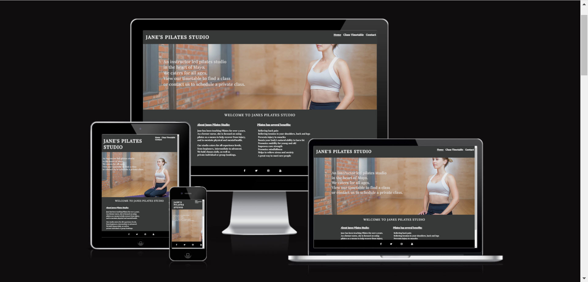
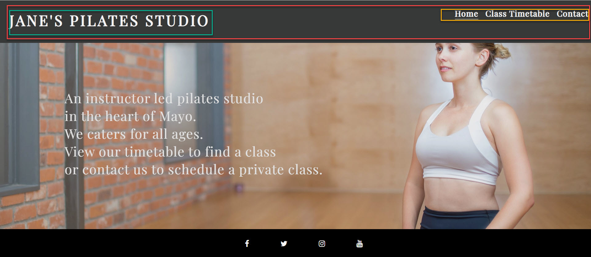
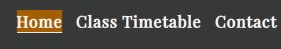
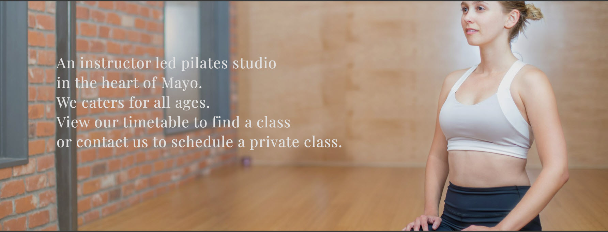
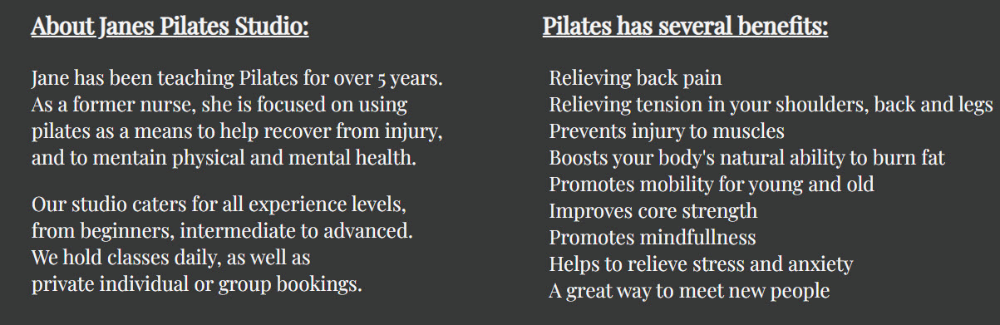
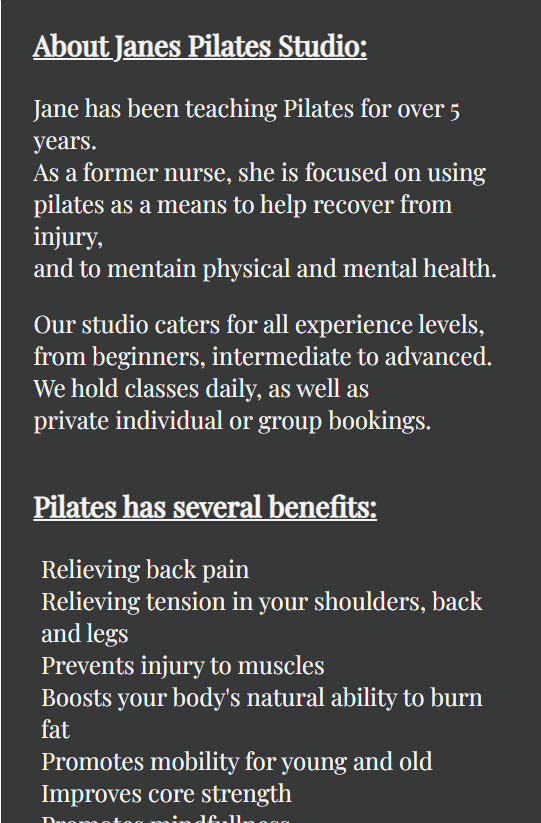
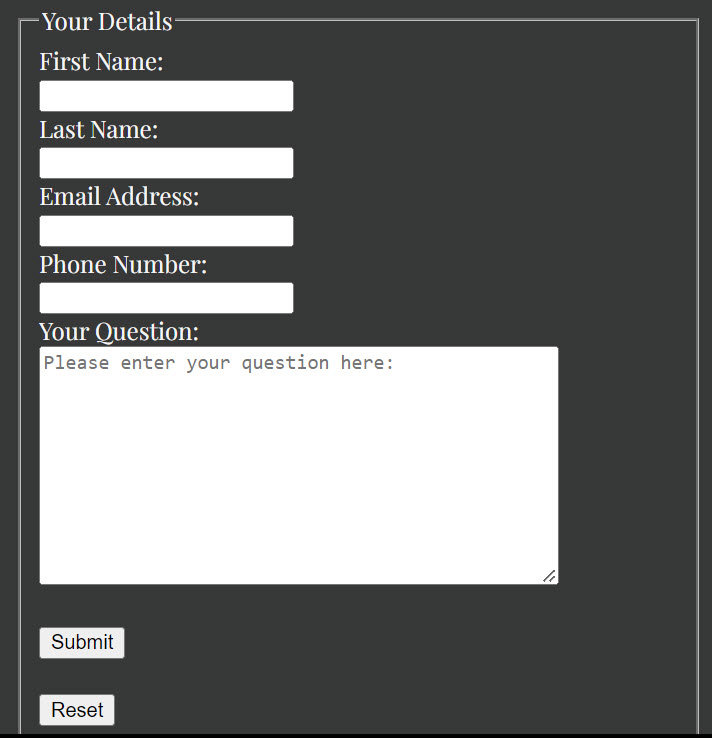

# Janes Pilates Studio
Welcome to the website for [Janes Pilates Studio](https://jillkerrb.github.io/Pilates/)

In this website, i decided to bring my own idea to life. This website a real need as my friend Jane is a qualified nurse who is changing career, and needs a website to attract and engage potential studenets. 

The benefit of this website to the site owner is to attract new, intermediate and advanced Pilates students to attend Pilates clases at Janes Pilates studio. 

The benefit to the external user is to find a Pilates studio where they can view a list of classes and times, and contact the studio if they require information on a private class.

## Features

### Featured on all 3 pages - Home, Timetable and Contact

* Header

The header element was added to give symantic clarity as well as to house the logo text and navigation menu. 
The header is consistent across all 3 pages to allow for consistency and ease of navigation for the user. The screenshot below shows the header section highlited in red, with the logo (highlighted in green) and the navigation menu (highlighted in yellow) contained within the header.

* Logo

The responsive logo text provides the name of the website in a identifiable location for the end user and is a clickable link that brings the user back to the homepage from any of the other pages. The logo highlights in dark orange when hovered to allow external users to identify that they are on the main page of Janes Pilates Studio, and to allow them to refresh the page without relying on the browser refresh. The screenshots below show the logo when not hovered over (dark grey) and when hovered over (dark orange).

Without hover:

With hover:

*  Navigation Menu

The responsice navigation menu is identical on all 3 pages - Home, Timetable and Contact. 
The navigation menu consists of an unordered list. Each list item contains an active link to allow users to identify what page they are currently on. A hover function has also been used to allow users to identify what page they are about to click on when they hover over a page link.
This section will allow the user to easily navigate from page to page across all devices without having to revert back to the previous page via the browser back button. 

Below screenshot shows the current page underlined as the page we are currently on, and shows the user hovering over the home page manu item:

* Footer

The footer is consistent across all 3 pages and is sticky so will not obscure the users view. The footer contains links to Janes Pilates Studio social media sites - Facebook, Twitter, Instagram and Youtube, so users can easily follow Janes Pilates Studio on social media. Each social media link will open in a new tab. 

### Featured on the Home page

* Hero Image

The hero image shows a young woman doing Pilates to catch the users attention. Text is placed over other image to inform the user of the purpose of the website. Both the image and text are reponsive to device size.

* About and Benefits Section

The about and benefits section are part of one Flexbox container. The about section contains is a paragraph of text that provides the user with some additional informaiton about Janes Pilates Studio. The benefits section provides a list of benefits the user can get from practicing Pilates. These sections are responsive, when viewed on a laptop device they will appear horizontally, and when viewed on a mobile device will stack vertically on top of each other. 

Laptop view:

Mobile view:

### Featured on the Timetable page

* Timetable
The timetable page provides the user with a table view of the classes and times available at Janes Pilates studio. The table is reponsive and allows users to scroll left and right when viewing on a mobile device. 

### Featured on the Contact page

* Form

A  responsive contact form allows the user to provide their contact information and ask a question from Janes Pilates studio, such as, how do they book a private class. 

## Features Left to Implement
As a future enhancement, i would like to introduce the ability for sudents to login and book classes, but time restrains and knowledge gaps meant this was not possible. This would ensure users would not be disappointed by turning up to a full class, and would provide the site owner information on how many users are booked into each class to avoid overcrowded classes and offer incentives for users to join classes with low numbers. It would also provide the site owner information on who has booked a class in case they need to contact end users due to class cancelations. 

## Testing

* Header
The header was created as the flex container "logo-nav-container", and then split into the logo and navigation menu horizontally,using classes "logo" and "nav-menu". Anchor links were added inside the logo and nav-menu classes to create the logo link, and the navigation links"

- HTML Code

  <!--<header>
      

        

          <a href="index.html">
            <h1>Jane's Pilates Studio</h1>
          </a>
        

        

          <nav>
            <ul>
              <li><a href="/index.html" class="active-link">Home</a></li>
              <li><a href="/timetable.html">Class Timetable</a></li>
              <li><a href="/contact.html">Contact</a></li>
            </ul>
          </nav>
        

      

    </header>-->

- CSS Code

The container was set as flex to enable elements to sit side by side.

<!--.logo-nav-container {
  display: flex;
  width: 100%;
}-->

All code was formatted with Prettier to remove spaces and format code
All code passed without errors in W3 Validator and Jigsaw
Used lighthouse in Developer tools to check accessibility and best practice and got a score of 100% for both accessibility and best practive. 

Responsiveness was tested using developer tools and selecting replicating different devices such as mobile devices and tablets.
one problem i could not overcome in my project was the ability to adjust the transparancy of the hero image using the opacity attribute without adjusting the transparancy of the text on top of the hero image. I would like to have only adjusted the hero imaage so as to have more contract between the background impact and the text. 

To get help with hero imaging width sizing, went to https://www.w3schools.com/howto/howto_css_hero_image.asp

