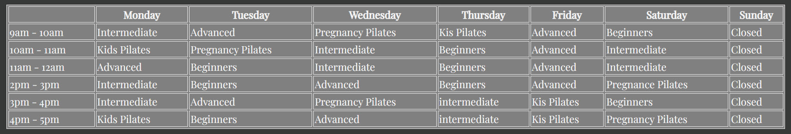

# Janes Pilates Studio
Welcome to the website for [Janes Pilates Studio](https://jillkerrb.github.io/Pilates/)
<p>In this website, i decided to bring my own idea to life. This website a real need as my friend Jane is a qualified nurse who is changing career, and needs a website to attract and engage potential studenets. </p>
<p>The benefit of this website to the site owner is to attract new, intermediate and advanced Pilates students to attend Pilates clases at Janes Pilates studio. </p>

<p>The benefit to the external user is to find a Pilates studio where they can view a list of classes and times, and contact the studio if they require information on a private class.</p>


## Features

### Featured on all 3 pages - Home, Timetable and Contact

* Header

The header element was added to give symantic clarity as well as to house the logo text and navigation menu. 
The header is consistent across all 3 pages to allow for consistency and ease of navigation for the user. The screenshot below shows the header section highlited in red, with the logo (highlighted in green) and the navigation menu (highlighted in yellow) contained within the header.


* Logo

The responsive logo text provides the name of the website in a identifiable location for the end user and is a clickable link that brings the user back to the homepage from any of the other pages. The logo highlights in dark orange when hovered to allow external users to identify that they are on the main page of Janes Pilates Studio, and to allow them to refresh the page without relying on the browser refresh. The screenshots below show the logo when not hovered over (dark grey) and when hovered over (dark orange).

Without hover:


With hover:


*  Navigation Menu

The responsice navigation menu is identical on all 3 pages - Home, Timetable and Contact. 
The navigation menu consists of an unordered list. Each list item contains an active link to allow users to identify what page they are currently on. A hover function has also been used to allow users to identify what page they are about to click on when they hover over a page link.
This section will allow the user to easily navigate from page to page across all devices without having to revert back to the previous page via the browser back button. 

Below screenshot shows the current page underlined as the page we are currently on, and shows the user hovering over the home page manu item:


* Footer

The footer is consistent across all 3 pages and is sticky so will not obscure the users view. The footer contains links to Janes Pilates Studio social media sites - Facebook, Twitter, Instagram and Youtube, so users can easily follow Janes Pilates Studio on social media. Each social media link will open in a new tab. 


### Featured on the Home page

* Hero Image

The hero image shows a young woman doing Pilates to catch the users attention. Text is placed over other image to inform the user of the purpose of the website. Both the image and text are reponsive to device size.


* About and Benefits Section

The about and benefits section are part of one Flexbox container. The about section contains is a paragraph of text that provides the user with some additional informaiton about Janes Pilates Studio. The benefits section provides a list of benefits the user can get from practicing Pilates. These sections are responsive, when viewed on a laptop device they will appear horizontally, and when viewed on a mobile device will stack vertically on top of each other. 

Laptop view:


Mobile view:


### Featured on the Timetable page

* Timetable
The timetable page provides the user with a table view of the classes and times available at Janes Pilates studio. The table is reponsive and allows users to scroll left and right when viewing on a mobile device. 



### Featured on the Contact page

* Form

A  responsive contact form allows the user to provide their contact information and ask a question from Janes Pilates studio, such as, how do they book a private class. 


## Features Left to Implement
As a future enhancement, i would like to introduce the ability for sudents to login and book classes, but time restrains and knowledge gaps meant this was not possible. This would ensure users would not be disappointed by turning up to a full class, and would provide the site owner information on how many users are booked into each class to avoid overcrowded classes and offer incentives for users to join classes with low numbers. It would also provide the site owner information on who has booked a class in case they need to contact end users due to class cancelations. 

## Testing

* Header
The header was created as the flex container "logo-nav-container", and then split into the logo and navigation menu horizontally,using classes "logo" and "nav-menu". Anchor links were added inside the logo and nav-menu classes to create the logo link, and the navigation links". 

- HTML Code

  ```
  <header>
      <div class="logo-nav-container">
        <div class="logo">
          <a href="index.html">
            <h1>Jane's Pilates Studio</h1>
          </a>
        </div>

        <div class="nav-menu">
          <nav>
            <ul>
              <li><a href="/index.html" class="active-link" aria-label="Link to home page">Home</a></li>
              <li><a href="/timetable.html" aria-label="Link to timetable page">Home>Class Timetable</a></li>
              <li><a href="/contact.html" aria-label="Link to contact form page">Home>Contact</a></li>
            </ul>
          </nav>
        </div>
      </div>
    </header>
    ```

- CSS Code

The container was set as flex to enable elements to sit side by side.

```
.logo-nav-container {
  display: flex;
  width: 100%;
```

- Responsive design

The header logo and navigation links are reponsive as the font size scales down on mobile devices:

 ```
 .logo {
    font-size: 3vw;
  }

  .nav-menu {
    font-size: 2vw;
  }
  ```

* Logo 
The logo was crated as a link using a href

- HTML code

```
<div class="logo">
          <a href="index.html">
```

- CSS code
The following code was added to style the logo. Font colour was inherited from a styling. 

```
.logo {
  letter-spacing: 4px;
  font-family: "playfair display", serif;
  flex-grow: 1;
  text-transform: uppercase;
}
```

- Responsive design
The following resizes the logo text when viewed on a mobile device

```
 .logo {
    font-size: 3vw;
  }
  ```

* Navigation menu
Nav links are added for symantics, to allow screen reads to identify that these links are for the sites main navigation. area-links are added to each navigation link to provide additional assistance to screen readers. The menu is made up of an unordered list containing 3 list items, one for each page. 

- HTML code

```
<div class="nav-menu">
          <nav>
            <ul>
              <li><a href="/index.html" class="active-link" aria-label="Link to home page">Home</a></li>
              <li><a href="/timetable.html" aria-label="Link to timetable page">Home>Class Timetable</a></li>
              <li><a href="/contact.html" aria-label="Link to contact form page">Home>Contact</a></li>
            </ul>
          </nav>
```
- CSS code

The navigation menu is formatted in the .nav-menu section. Under the a section, the default like underline is removed, and under the a:hover section, the background colour is added for when an end user hovers over a link. The .active-link adds an underline to the navigation menu page that the users is currently on. The code for the .active-link was taken from the Love Running project.

```
.nav-menu {
  letter-spacing: 1px;
  display: inline-flex;
  justify-content: right;
}

a {
  text-decoration: none;
  color: whitesmoke;
}

a:hover {
  background-color: rgb(169, 96, 7);
}

/*active link code taken from love running project*/

.active-link {
  border-bottom: 1px solid whitesmoke;
}
```
- Responsive design
The font size will adapt for mobile devices.

```
 .nav-menu {
    font-size: 2vw;
  }
  ```


* Footer

The footer provides a semantic element to help screenreaders identify the section as a footer. 
The footer elements are list items that contain links to social media accounts. 
The links open in a new tab by using the _blank attribute.
The noopener attribute stops the external site from having access to Janes Pilates Studio site and therefore enhances security. 
The aria-label enhancenses the exterience for users using screen readers. 
The div class "footer-container" was created in order to style the footer in CSS.
The code for this was taken from the Love Running project, but was adapted slightly to fit with my project. 

- HTML code

```
<footer id="footer">
      <div class="footer-container">
        <ul>
          <li class="facebook">
            <a
              href="https://www.facebook.com/"
              target="_blank"
              rel="noopener"
              aria-label="Visit our Twitter page (opens in a new tab)"
              ><i class="fa fa-facebook"></i
            ></a>
          </li>

          <li class="insta">
            <a
              href="https://twitter.com"
              target="_blank"
              rel="noopener"
              aria-label="Visit our Twitter page (opens in a new tab)"
              ><i class="fa fa-twitter"></i
            ></a>
          </li>

          <li class="twitter">
            <a
              href="https://instagram.com"
              target="_blank"
              rel="noopener"
              aria-label="Visit our Instagram page (opens in a new tab)"
              ><i class="fa fa-instagram"></i
            ></a>
          </li>

          <li class="youtube">
            <a
              href="https://youtube.com"
              target="_blank"
              rel="noopener"
              aria-label="Visit our YouTube page (opens in a new tab)"
              ><i class="fa fa-youtube"></i
            ></a>
          </li>
        </ul>
      </div>
    </footer>
```

- CSS code

Set position and colours with the #footer and removed additional space at the side of the footer by setting marfin, border and padding for the footers unorder list items. 

```
#footer {
  background: black;
  padding: 20px;
  position: fixed;
  left: 0;
  bottom: 0;
  width: 100%;
  color: white;
  text-align: center;
}

#footer ul {
  margin: 0;
  border: 0;
  padding: 0;
}
```


* Hero image and text

The hero image was added using a div with an id called "hero-image" in the HTML which was linked to the image destination in the CSS. Text was added on top of the hero image to help users identify what the site is about.

- HTML code 

```
<div id="hero-image">
      <p>
        An instructor led pilates studio<br>
        in the heart of Mayo. <br>
        We caters for all ages.<br>
        View our timetable to find a class<br>
        or contact us to schedule a private class.
      </p>
    </div>
  ```
  - CSS code:

The no repeat ensured that the image deos  not repeat if the screen size is larger than the image. The width and height of the image is set and centered on the page. The opacity is set to make the image and text contrast slightly better.

```
#hero-image {
  background: url("../images/hero-image.jpg") no-repeat center center;
  height: 450px;
  width: 100%;
  background-size: cover;
  opacity: 0.9;
```

- Responsive design: 

The text on the image is coded to resize on a smaller device and padding is set.

 ```
 #hero-image p {
    padding-top: 50px;
    padding-left: 10px;
    font-size: 2vh;
  ```

  *About section and Benefits section

- HTML code

Two sections are added for semantics, to inform the users that there are 2 related sections.
An flex container called "about-benefits-container" is used to contain the 2 sections. Within this container are two flexboxes created with classes. Class "about" contains a heading and 2 paragraphs. Class "benefits"contains a heading and several list items in an unordered list. 

```
   <div class="about-benefits-container">
      <section>
        <div class="about">
          <h3>About Janes Pilates Studio:</h3>
          <p>
            Jane has been teaching Pilates for over 5 years.<br>
            As a former nurse, she is focused on using <br>
            pilates as a means to help recover from injury,<br>
            and to mentain physical and mental health.
          </p>
          <p>
            Our studio caters for all experience levels,<br>
            from beginners, intermediate to advanced.<br>
            We hold classes daily, as well as<br>
            private individual or group bookings.
          </p>
        </div>
      </section>
      <section>
        <div class="benefits">
          <h3>Pilates has several benefits:</h3>
          <ul>
            <li>Relieving back pain</li>
            <li>Relieving tension in your shoulders, back and legs</li>
            <li>Prevents injury to muscles</li>
            <li>Boosts your body's natural ability to burn fat</li>
            <li>Promotes mobility for young and old</li>
            <li>Improves core strength</li>
            <li>Promotes mindfullness</li>
            <li>Helps to relieve stress and anxiety</li>
            <li>A great way to meet new people</li>
          </ul>
        </div>
      </section>
    </div>
    ```
    - CSS code

    First the container is styled in ",about-benefits-container" as flex to allow the sections to stack horizontally. The container is also positioned and width added. 
    Styles that are common to both the about section and the benefits section are added to ",about .benefits, auch as the padding and borders.
    Specific styling is added to the benefits section header with .benefits h3, to move the heading for this section further to the right. 
    Then styling is added specifically to the benefits ul to remove to default padding with padding-inline-start: 5rem; and the list items are styled for position and to remove the bullet points. 


    ```
    .about-benefits-container {
  display: flex;
  width: 95%;
  justify-content: center;
  padding-bottom: 50px;
}

.about .benefits {
  border: 20rem;
  padding-left: 50px;
  width: 100%;
  margin: 20rem auto;
}

.benefits h3 {
  margin-left: 80px;
  text-decoration: underline;
}

.benefits ul {
  padding-inline-start: 5rem;
}

.benefits li {
  display: list-item;
  list-style-type: none;
  color: whitesmoke;
  padding-left: 5px;
  padding-right: 5px;
  justify-content: right;
}


All code was formatted with Prettier to remove spaces and format code
All code passed without errors in W3 Validator and Jigsaw
Used lighthouse in Developer tools to check accessibility and best practice and got a score of 100% for both accessibility and best practive. 

Responsiveness was tested using developer tools and selecting replicating different devices such as mobile devices and tablets.
one problem i could not overcome in my project was the ability to adjust the transparancy of the hero image using the opacity attribute without adjusting the transparancy of the text on top of the hero image. I would like to have only adjusted the hero imaage so as to have more contract between the background impact and the text. 


To get help with hero imaging width sizing, went to https://www.w3schools.com/howto/howto_css_hero_image.asp

